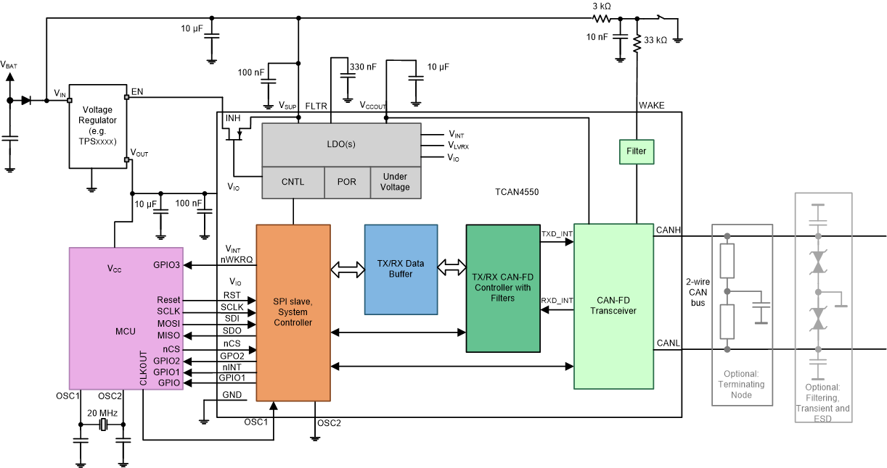

# Projects for Taltech students

## Project 1: UAV navigation in GNSS-denied environment

1. Summary

The goal of this project is to build a proof-of-concept of a drone that is able to operate in a GNSS-denied environment.

Relevant paper: [link](https://www.research-collection.ethz.ch/bitstream/handle/20.500.11850/52698/eth-5889-02.pdf)

2. Project vision & success criteria

- Attach Sensor Module component to bike
- Ride bike and make sure that data from GPS and localisation component is matched

Optional:
- Reverse engineer communication protocol used on Mavic 3

1. Requirements

- GNU/Linux computer (or macOS)
- Digital analyzer/Oscilloscope
- C/C++
- Embedded electronics

4. Cost & Budget

- [Optical Flow and Distance Sensor Module](https://arkelectron.com/product/ark-flow/) (250$)

## Project 2: Implement named topics in Pycyphal

1. Summary

The goal of this project is to add a new feature to Pycyphal: named topics.

The way this is done is by using Raft: a decentralized consensus algorithm. Once the nodes have elected a Leader, that node is responsible for keeping track of the Topic Name for each node.

The reason why this is interesting: this would allow Cyphal to serve as a communication layer between PX4 and ROS.

2. Project vision & success criteria

- A (partly implemented) proof-of-concept can be found here: [OpenCyphal-Garage/cyraft](https://github.com/OpenCyphal-Garage/cyraft/tree/main/cyraft)
- Finish this proof-of-concept
- Based on proof-of-concept, implement "named topics" in Pycyphal
- Add support for Named Topics in Yakut
- Success: able to setup up multinode Cyphal system where each node caries it's own unique Name (that can be inspected using Yakut)
- If interested: continue to develop this by implementing support for Cyphal in ROS.

3. Requirements

- GNU/Linux computer (or macOS)
- Python
- Some understanding of networks

4. Cost & Budget

- 0eu

## Project 3: Implement UAVCAN driver for TI TCAN4550

1. Summary

Many popular MCUs lack built-in CAN FD-capable controllers, which limits the uptake of CAN FD in new products. There is an interesting IC that could help new hardware revisions or designs adopt CAN FD without having to port an existing codebase to a new platform: TI TCAN4550 -- a single-chip CAN FD controller with a built-in 5 Mbps transceiver interfaced with the MCU via SPI:

It is also appealing price-wise, being available from DigiKey for $1.5 @ 1k pcs, which is comparable to a regular standalone CAN transceiver.

This is a very promising chip and it would be nice to have portable and reusable drivers for it here.

2. Project vision & success criteria

- Start with being able to send/receive CAN frames from board
- Implement Cyphal on board
- Test: computer sends a Cyphal message through CANFace, corresponding LED lights up on the board.
- Test: computer subscribes to a Cyphal topic, and is able to retrieve some information from the board.

3. Requirements

- GNU/Linux computer
- Digital analyzer/Oscilloscope
- C/C++
- Embedded electronics

4. Cost & Budget

- CanFace
- TI Board
- Flasher/debugger

